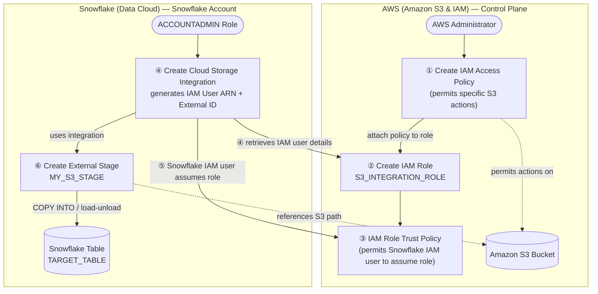

# Data Processing Pipeline

**Team: CAPONE Probono Data FTB**

**Authors:** [Nathan Oh](mailto:noh@volunteers.ftb.org)

**Status:** Completed

**Created:** Jun 26, 2026

**Last Updated:** Aug 14, 2026

# Background

Feeding Tampa Bay (FTB) maintains data across multiple platforms (NetSuite/Waerlinx, Ceres/Microsoft Dynamics, Salesforce, CAP60 and others) and spreadsheet applications (Google sheets and Excel). There are limited systemic connections between the platforms and adherence to the organizations’ file naming policy is not routinely enforced, resulting in a fragmented structure of supplemental spreadsheets. They want to leverage their client data, warehouse/inventory data, and external indicators (census data, Moody’s subscription) to build predictive models that forecast communities need, optimize resource allocation, and guide strategic decision-making.

# Goal

The goal of building a data infrastructure for FTB is to 

1) Establish an analytical data storage solution using Snowflake

2) build data pipelines from priority sources (MapTheMealGap (MMG) \+ NetSuite/Waerlinx \+ Ceres/Microsoft Dynamics) into the analytics layer to be consumed downstream for dashboarding and food insecurity rate prediction

# Open Questions

## Analytical data storage solution storing source data

Completed **Option 1: As discussed with FTB. Option 2 is just an interim solution.**

Option 1: Snowflake

Option 2: Azure Synapse/DB

## Loading Netsuite data to Snowflake

Completed **Option 1: Eliminates the need to pass S3.**

Option 1: Netsuite connector to Snowflake

Using the netsuite connector, we can directly import data from netsuite into snowflake tables.

Option 2: Manual upload to S3 \+ Snowpipe

When monthly or yearly map the meal gap or netsuite data is available, export them into CSV files and manually upload the files in S3.

## Securely accessing Amazon S3 from Snowflake

Completed **Option 1: Snowflake highly recommends this option, which avoids the need to supply AWS IAM credentials when creating stages or loading data.**

Option 1: Configure a Snowflake storage integration to access Amazon S3

Configure a storage integration object to delegate authentication responsibility for external cloud storage (AWS) to a Snowflake identity and access management (IAM) entity.

Option 2: Configure AWS IAM user credentials to access Amazon S3

Configure an AWS IAM user with the required permissions to access your S3 bucket. This one-time setup involves establishing access permissions on a bucket and associating the required permissions with an IAM user. You can then access an external (i.e. S3) stage that points to the bucket with the **AWS key and secret key**.

## Data ingestion from S3 to Snowflake

Completed **Option 1: Snowpipe Batch.**

Option 1: Snowpipe Batch

Create a storage integration \+ external stage on S3, then a pipe with auto\_ingest=true wired to S3 event notifications (SNS/SQS) that triggers an ObjectCreated event broadcasted by the SNS  to the SQS queue detected by the pipe. Best for continuous/near-real-time micro-batches.

Option 2: Bulk COPY INTO

Manual or scheduled COPY INTO \<table\> FROM @stage against the external stage. Best for scheduled large batch loads where latency isn't critical.

## Transformation of Raw Data in Snowflake

Completed Option 1: SQL query \+ Dynamic Tables

Option 1: SQL query \+ Dynamic Tables

Option 2: SQL query \+ Tables

# Proposal

The AWS- and Snowflake-based data architecture for building data pipelines from priority sources for prediction and heatmap dashboarding is as follows:

| Component | Description |
| :---- | :---- |
| 1 | Map the Meal Gap Source Data |
| 2 | Ceres Source Data |
| 3 | Netsuite Source Data |
| 4 | S3 prefix for storing data source derived from annual Map the Meal Gap (csv) |
| 5 | S3 prefix for storing data source derived from Ceres/Microsoft (parquet) |
| 6 | Netsuite Connector directly connects Netsuite with snowflake |
| 7 | Snowpipe enables loading data files from S3 as soon as they’re available in a stage. This means you can load data from files in micro-batches |
| 8 |  |
| 9 | Bronze layer storing Raw ingested data |
| 10 | Silver layer storing Filtered, Cleaned, and augmented data |
| 11 | Gold layer storing Business-level aggregated data |
| 12 | Heatmap Dashboard using Power BI |
| 13 | Regression Model predicting food insecurity rates |

In terms of the implementation, the above data architecture is broken down in 3 stages:

1. **Access:** To read data from and write to an S3 bucket into Snowflake, the security and access management policies on the bucket must allow Snowflake to access the bucket.  
2. **Ingestion:** Once access is established between AWS and Snowflake, we can ingest data sources stored in AWS S3 and staged in external stages to Snowflake tables using snowpipe or COPY INTO command.  
3. **Transformation:** Once data sources land in Snowflake, data can be logically organized through each layer of the medallion architecture, a data design pattern used to logically organize data in a lakehouse, with the goal of incrementally and progressively improving the structure and quality of data as it flows through each layer of the architecture (from Bronze ⇒ Silver ⇒ Gold layer tables).

The following sections will detail how we implemented each stage throughout this project cycle.

## 1\. Access

Snowflake requires permissions on an S3 bucket to be able to access its objects (files) under the prefix.

This system diagram below illustrates the step-by-step architecture to establish a secure, credential-less connection between Amazon Web Services (AWS) and Snowflake using a Storage Integration object. The diagram is divided into two primary environments to show the separation of duties and secure handshakes:

* **AWS**: The cloud storage layer containing the data and security policies.

* **Snowflake**: The analytical data platform executing the data loads.



### 1\. Create an IAM Access policy in AWS account

Write a JSON **policy** granting Snowflake the four required permissions on your bucket/prefix. Object actions target prefix ARN **(arn:aws:s3:::\<bucket\>/\<prefix\>/\*)**, while ListBucket/GetBucketLocation target the **bucket ARN** itself with an s3:prefix condition.

* s3:GetObject

* s3:GetObjectVersion

* s3:ListBucket

* s3:GetBucketLocation.

Add s3:PutObject/s3:DeleteObject only if you need to unload or purge — for load-only, use the read-only variant.

Also check STS is **Active** for your region under IAM → Account settings.

### 2\. Create the IAM role in AWS account

Create a role with trusted entity \= AWS account → Another AWS account, entering your own **account ID** temporarily and checking **external ID** with a placeholder like 0000\. The placeholders are intentional — you overwrite them in Step 5 once the externalId from Snowflake storage integration object is created. Attach the policy created in Step 1 to the role.

### 3\. Create the storage integration in Snowflake account

```sql
CREATE STORAGE INTEGRATION <name>
TYPE = EXTERNAL_STAGE
STORAGE_PROVIDER = 'S3'
ENABLED = TRUE
STORAGE_AWS_ROLE_ARN = '<role ARN from Step 2>'
STORAGE_ALLOWED_LOCATIONS = ('s3://<bucket>/<path>/');
```

To run this SQL command, You need to be in the ACCOUNTADMIN role or have the global CREATE INTEGRATION privilege. 

For STORAGE\_AWS\_ROLE\_ARN, you need the ARN of the IAM role you created in Step 2\.

STORAGE\_ALLOWED\_LOCATIONS is the permission ceiling you’re giving to the integration, which external stages in Step 6 will reference.

### 4\. Retrieve Snowflake's generated IAM identity

Run the following SQL command to get metadata on your storage integration created in Step 3:

```sql
DESC INTEGRATION <name>;
```

Look for two values:

* **STORAGE\_AWS\_IAM\_USER\_ARN** (the IAM user Snowflake provisioned — one per Snowflake account, shared by all its S3 integrations)

* **STORAGE\_AWS\_EXTERNAL\_ID** (auto-generated if you didn't specify one).

### 5\. Update the role's trust policy in AWS account

In your IAM role, go to Trust relationships and Edit trust policy. Replace the placeholders (STORAGE\_AWS\_IAM\_USER\_ARN, STORAGE\_AWS\_EXTERNAL\_ID) with the values obtained from step 4\. This closes the two-pass handshake.

```json
{
  "Effect": "Allow",
  "Principal": { "AWS": "<STORAGE_AWS_IAM_USER_ARN>" },
  "Action": "sts:AssumeRole",
  "Condition": { "StringEquals": { "sts:ExternalId": "<STORAGE_AWS_EXTERNAL_ID>" } }
}
```

NOTE: In case you re-create the storage integration, it regenerates the external ID — you must re-run DESC and update this trust policy again, or access breaks. Validate with SYSTEM$VALIDATE\_STORAGE\_INTEGRATION.

### 6\. Create the external stage (Snowflake)

```sql
CREATE STAGE my_s3_stage
STORAGE_INTEGRATION = s3_int
URL = 's3://bucket/path/'
FILE_FORMAT = my_csv_format;
```

**Permissions Required:** Needs **CREATE STAGE** on the schema \+ **USAGE** on the integration. To use the stage for loading, a role only needs USAGE on the stage — not on the integration.

For more details of this stage, Please read [here](https://docs.snowflake.com/en/user-guide/data-load-s3-config-storage-integration).

## 2\. Ingestion

Once the access is all set up, we have to ingest the data sources into snowflake tables for downstream use. Below are the approaches to ingesting different data sources based on their frequency, connector tool availability, etc:

1. **MMG:** Since it needs to be ingested annually when it is published by FANO, we used **Snowpipe**, a Snowflake object that loads data from files as soon as they are available in a stage. The data is loaded according to the COPY statement defined in a referenced pipe.For more details on snowpipe, see [Snowpipe](https://docs.snowflake.com/en/user-guide/data-load-snowpipe-intro).  
2. **Ceres:** Since it requires only one-time ingestion, we just uploaded it to the S3 bucket externally staged in Snowflake and ran the COPY INTO command to the snowflake table we want to ingest. For more details on the command, please see [COPY INTO \*\<table\>\*](https://docs.snowflake.com/en/sql-reference/sql/copy-into-table).  
3. **Netsuite**: Since FTB team plans to integrate netsuite directly into the snowflake for their ingestion, we did not upload this data to the S3 bucket and let them handle it.

In this section, setting up Snowpipe for MMG data source was the main work we had to do.

For ingesting data dispersed in multiple tabs (county, census-tract, zip-code, state, etc), first download each tab in the MMG annual report (Excel file) into CSV format.

 

Follow the instructions triggering Snowpipe data loads from external stages on S3 automatically using Amazon SQS (Simple Queue Service) notifications for an S3 bucket, see [Automating Snowpipe for Amazon S3](https://docs.snowflake.com/en/user-guide/data-load-snowpipe-auto-s3#option-1-creating-a-new-s3-event-notification-to-automate-snowpipe).

The most important thing to note here is that Snowpipe will not retroactively ingest data that was already uploaded to S3 before we configure SNS as the destination for the S3 event notification the pipeline was created because the SNS on the Snowflake side that triggers the pipe will receive createObject events (uploading new files) only after the configuration. To load any backlog of data files that existed in the external stage before SQS notifications were configured by manually triggering the pipe, see [Loading historic data](https://docs.snowflake.com/en/user-guide/data-load-snowpipe-manage#label-snowpipe-load-historic-data) or [s3\_ingestion.ipynb](https://github.com/ltk1877/ftb-pro-bono/blob/main/ingestion/s3_ingestion.ipynb) in the github repo.

Once the csv files are uploaded in S3, check if the data has loaded into the snowflake table within minutes. You can go to each snowflake table in Snowsight (Snowflake Web Console) and click ‘data preview’ to see if data was ingested or not.

### Ceres historical load

Ceres was FTB's former Business Central ERP, now retired. Unlike MMG, this was a single, non-recurring extract from a system that will never produce a new file again, so it used a plain `COPY INTO` rather than Snowpipe — an `auto_ingest` pipe wired to `raw/ceres/` would just be a permanent, inert object with nothing left to trigger it. Scale: 1,404 tables, ~59.6M rows.

- **Storage**: one parquet file per table (from the original database export) at `s3://snowflakestaging1-975050112931-us-east-1-an/raw/ceres/<table-name>/<table-name>.parquet`.
- **Snowflake objects**: a new external stage, `ftb.bronze.ceres_stage`, scoped to the `raw/ceres` prefix on the same storage integration (`s3_snowflakestaging1`) the MMG pipeline uses — deliberately a new stage rather than widening the existing `ftb.bronze.s3_stage`, which is scoped to `raw/mmg` and backs the unrelated Snowpipe pipeline above. Also a new file format, `ftb.bronze.parquet_ff` (`TYPE = PARQUET, BINARY_AS_TEXT = FALSE`) — several Business Central tables carry a raw SQL Server rowversion `timestamp` column with no logical Parquet type, and Snowflake's default `BINARY_AS_TEXT = TRUE` tries to decode that as UTF-8 text and fails on it.
- **Load**: for each table, `ingestion/load_ceres_bronze.py` runs

  ```sql
  CREATE OR REPLACE TABLE ftb.bronze."<table>"
    USING TEMPLATE (
      SELECT ARRAY_AGG(OBJECT_CONSTRUCT(*))
      FROM TABLE(INFER_SCHEMA(LOCATION => '@ftb.bronze.ceres_stage/<table>/', FILE_FORMAT => 'ftb.bronze.parquet_ff'))
    );

  COPY INTO ftb.bronze."<table>"
  FROM '@ftb.bronze.ceres_stage/<table>/'
  FILE_FORMAT = (FORMAT_NAME = 'ftb.bronze.parquet_ff')
  MATCH_BY_COLUMN_NAME = CASE_INSENSITIVE;
  ```

  Table and column names are preserved exactly as extracted, via quoted identifiers — no renaming or type coercion beyond what Snowflake's own Parquet schema inference does. A later script will do the bronze → silver cleanup (renaming, type normalization), the same as for the MMG sources.
- **Access**: loaded under `ftb_loader_role` (see `provisioning/provision_bronze_access.sql`), the same write-capable service role used for the gold CSV loads, extended with `CREATE TABLE`/`CREATE STAGE`/`CREATE FILE FORMAT` on `bronze` and `USAGE` on `s3_snowflakestaging1`.
- **Re-run safety**: idempotent via `CREATE OR REPLACE`, but not scheduled — this is a one-time historical load, not a pipeline.

## 3\. Transformation

Once the source data is ingested into snowflake tables in the bronze schema (ftb.bronze.{table\_name}), we wrote different data wrangling scripts for each source data from MMG to rename and remove columns, convert types to normalize ratios and percentages.  
For more details on those scripts, please see scripts in [here](https://github.com/ltk1877/ftb-pro-bono/tree/main/transformation). The cleaned data will be stored in a silver schema, ready to be aggregated into gold layer tables.

## 4\. Consumption — Power BI

Power BI reads from `FTB.GOLD` only, connecting as a dedicated service user rather than an individual's Snowflake login, so the report keeps working — and keeps refreshing on a schedule — no matter who's signed into Power BI at the time.

> A naming note: the account/schema/table identifiers below (`FTB`, `GOLD`, `POWER_BI_*`) are kept uppercase because that's how they're already deployed in the account — Power BI's M queries resolve objects by exact name against the Snowflake catalog, so retyping them lowercase in the SQL below wouldn't rename anything (Snowflake folds unquoted identifiers to uppercase regardless), but retyping them lowercase in the M code in "Connecting Power BI" below *would* need to still match the catalog's stored value. Kept consistent with what's actually live rather than mixing conventions. New objects we create from scratch (like the Ceres pipeline above) use the lowercase convention instead.

### Service account and role

```sql
CREATE ROLE POWER_BI_READER_ROLE;

CREATE USER POWER_BI_SVC_USER
  RSA_PUBLIC_KEY = '<public key>'
  DEFAULT_ROLE = POWER_BI_READER_ROLE
  DEFAULT_WAREHOUSE = POWER_BI_WH
  TYPE = SERVICE;

GRANT USAGE ON DATABASE FTB TO ROLE POWER_BI_READER_ROLE;
GRANT USAGE ON SCHEMA FTB.GOLD TO ROLE POWER_BI_READER_ROLE;
GRANT SELECT ON ALL TABLES IN SCHEMA FTB.GOLD TO ROLE POWER_BI_READER_ROLE;
GRANT SELECT ON FUTURE TABLES IN SCHEMA FTB.GOLD TO ROLE POWER_BI_READER_ROLE;
```

- **Auth**: RSA key-pair (`SNOWFLAKE_JWT` authenticator), not a password — the private key is held outside the repo, the public key is registered on the user.
- **Read-only, on purpose**: `POWER_BI_READER_ROLE` only ever gets `SELECT`, and only against `GOLD` — never `BRONZE`/`SILVER`, never a write privilege. It's kept as a separate role from `FTB_LOADER_ROLE` (the write-capable role used for the loads described above) specifically so a compromised or misconfigured BI connection can't write or drop anything.
- **Future grant**: `SELECT ON FUTURE TABLES/VIEWS/DYNAMIC TABLES IN SCHEMA FTB.GOLD` means any new table landing in GOLD is automatically readable by Power BI — no follow-up grant needed each time a new gold table is created.
- **Account identifier gotcha**: connections must use the full org-account identifier (`a6484859099771-occ89006`), not the bare account locator (`OCC89066`) — the locator alone 404s on login. Hit this independently while setting up both `POWER_BI_SVC_USER` and `FTB_LOADER_SVC_USER`.

### Connecting Power BI

Each table's Power Query source calls the native `Snowflake.Databases` connector against server `a6484859099771-occ89006.snowflakecomputing.com`, warehouse `POWER_BI_WH`, role `POWER_BI_READER_ROLE`, authenticating with the `POWER_BI_SVC_USER` key-pair credential:

```m
let
    Source = Snowflake.Databases("a6484859099771-occ89006.snowflakecomputing.com", "POWER_BI_WH", [Role="POWER_BI_READER_ROLE"]),
    FTB_Database = Source{[Name="FTB",Kind="Database"]}[Data],
    GOLD_Schema = FTB_Database{[Name="GOLD",Kind="Schema"]}[Data],
    Table = GOLD_Schema{[Name="<TABLE_NAME>",Kind="Table"]}[Data]
in
    Table
```

To make the report refresh for the whole team rather than one person's Desktop install, the same Snowflake connection is registered once in the Power BI Service (gear icon → Manage connections and gateways) and shared to everyone who needs it. The published dataset's data source is then mapped to that shared connection and put on a scheduled refresh, instead of every viewer needing their own Snowflake login or a personal one-off credential. See `docs/pbi_gold_migration.md` for the full table-by-table walkthrough of repointing the report.

### Key rotation

Snowflake users support two simultaneous public keys (`RSA_PUBLIC_KEY` / `RSA_PUBLIC_KEY_2`), so the credential can be rotated with zero downtime: add the new key to the secondary slot, cut Power BI over to the new private key, confirm it connects, then unset the old key and delete its private key file. Recommended cadence: every 90–180 days, or immediately on suspected compromise.

# Integration with Github

For version control, we created a public [Github repository](https://github.com/ltk1877/ftb-pro-bono) to store all the scripts building the above data pipeline in Snowflake and the model development scripts predicting the food insecurity rate.

Snowflake allows you to access your Git repository over a public network by integrating workspaces with a Git repository. This section outlines how to push and pull files to and from your git repo in Snowsight.

### Snowflake Authentication objects

We configured the following snowflake objects for authenticating with a token to connect to our repository from snowflake:

1. Github PAT Secret

2. API integration

For more information on how to create them, please read [here](https://docs.snowflake.com/en/developer-guide/git/git-setting-up-public).

The above needs to be done once with an admin with an ACCOUNTADMIN role, not with every snowflake user trying to connect to the repo. Instead, the admin needs to just grant USAGE permissions on both objects to the role for a user or a group contributing to the repo.

### Create a Git workspace

With the created objects, we created a **Git workspace** to start pulling new files from the repo into snowflake and pushing back your changes to the repo. For more details on how to create one, please read [here](https://docs.snowflake.com/en/user-guide/ui-snowsight/workspaces-git#label-create-a-git-workspace).

